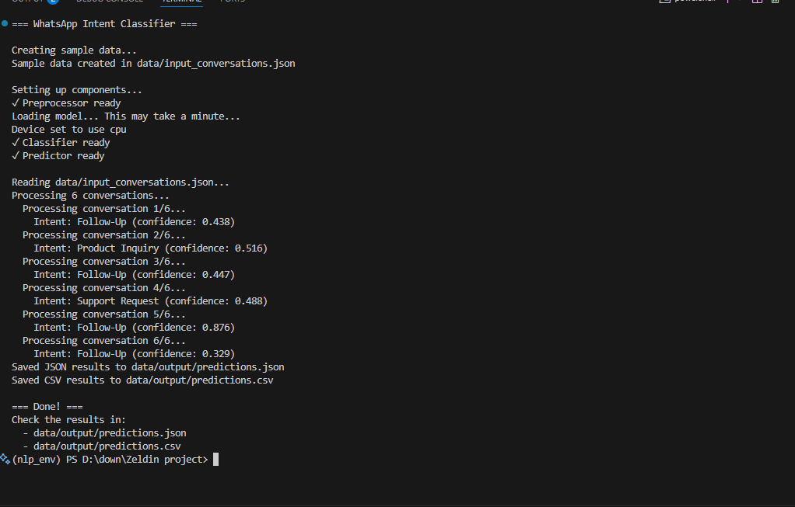

# WhatsApp Intent Classifier

A simple pipeline for classifying user intent in WhatsApp-like chat conversations using NLP (zero-shot learning).

## Features
- Cleans and preprocesses chat history
- Uses a pre-trained transformer model to classify the intent
- Supports batch prediction for multiple conversations
- Outputs results in both JSON and CSV

## Supported Intents
- Book Appointment
- Product Inquiry
- Pricing Negotiation
- Support Request
- Follow-Up

---

## Sample Output

Below is a sample prediction output:




## Quick Start

### 1. Install Requirements

```bash
pip install -r requirements.txt
